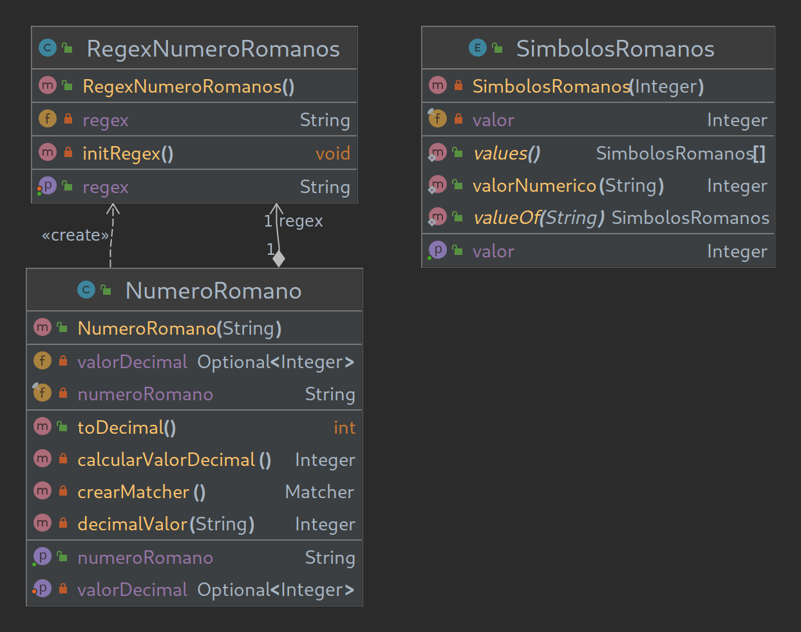

# Romanos Reguleros

## Romans Go Home! Kata Programación DAW Dual
Los numeros romanos no son tan simples como parecen para una máquina. Usa las expresiones regulares para ayudarte en esta tarea.  
Crea el programa con la ayuda del diagrama UML.  

The roman numbers are not as easy as they seem for a machine. Use regular expressions to help you with the task.  
Create the program with the help of the UML diagram.  

Made using pair-programming with [@ErikPC](https://github.com/ErikPC)  

## Key-Concepts :dart: 
- Enums
- Regex
- MMXXI
- JUnit 5

## UML
